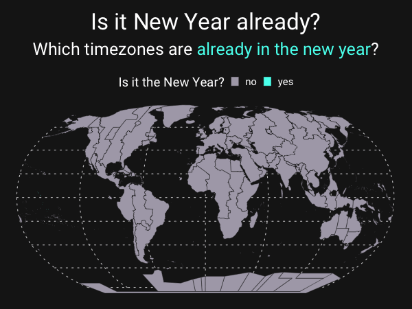

# Is it New Year already?

Which time zones are in the new year?

## Setup

The time zone map is generated with R through a Quarto document. The update of the Quarto document is automated using Github Actions. A [workflow](.github/workflows/render-and-publish.yml) generates the document and pushes it to Github Pages on a given schedule.
